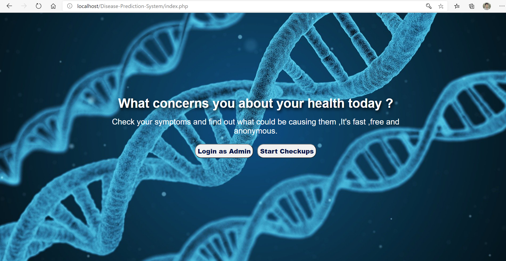
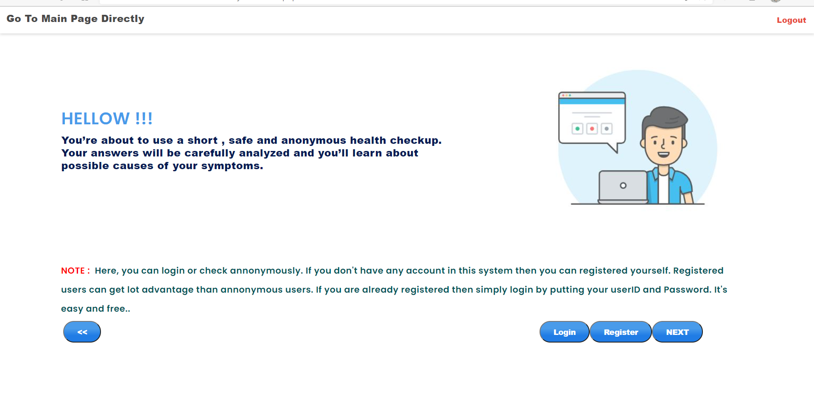
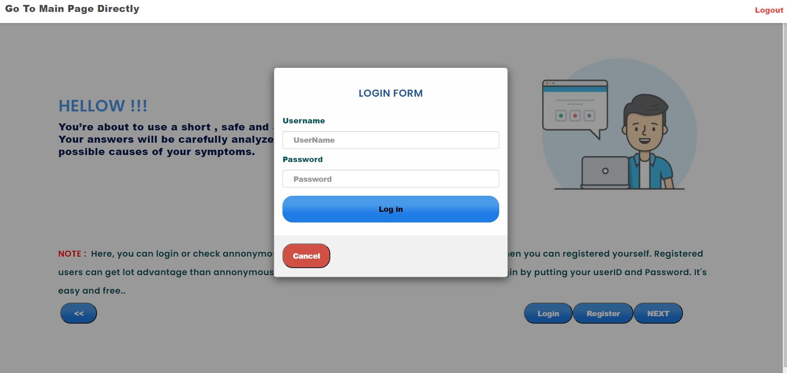
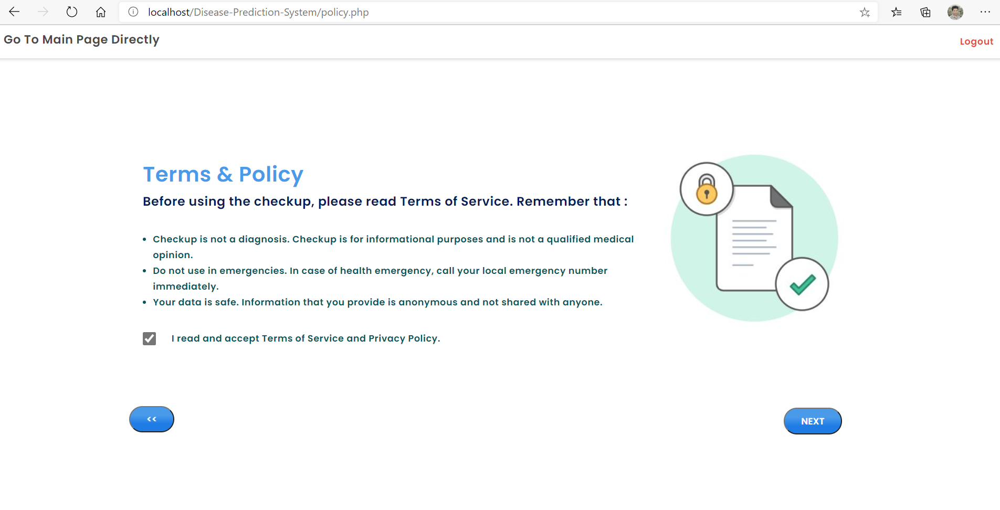
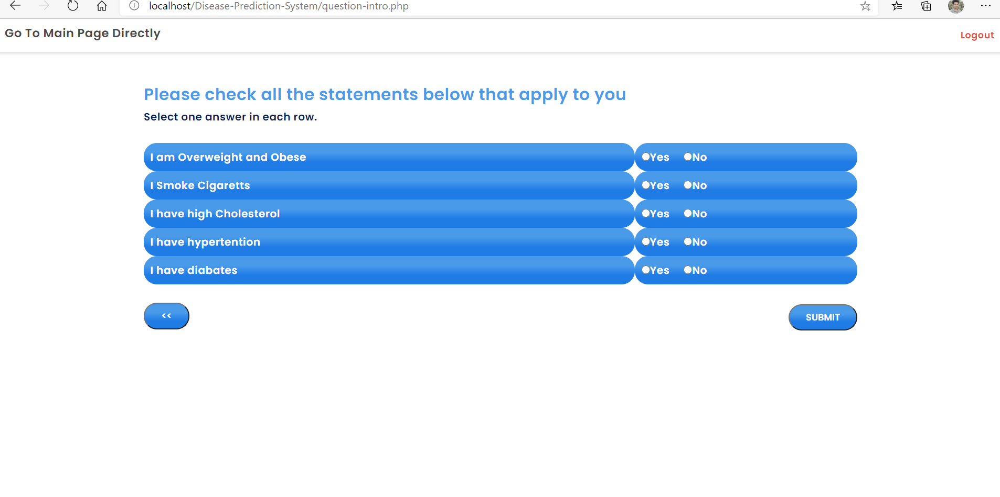
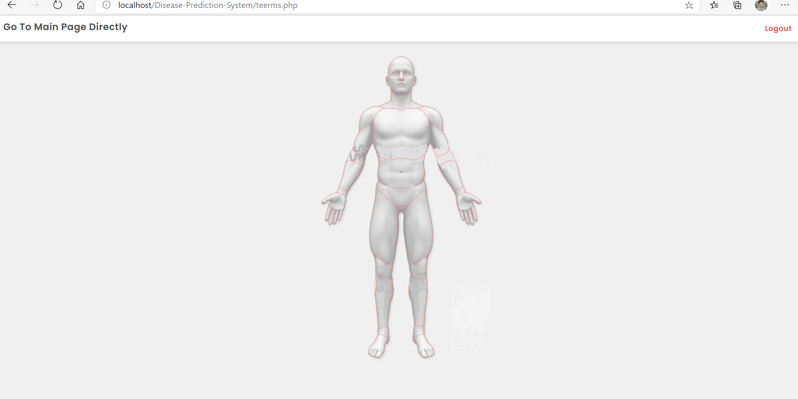
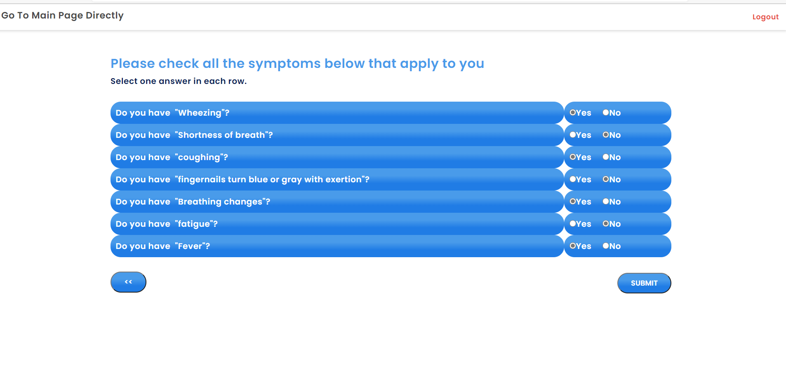
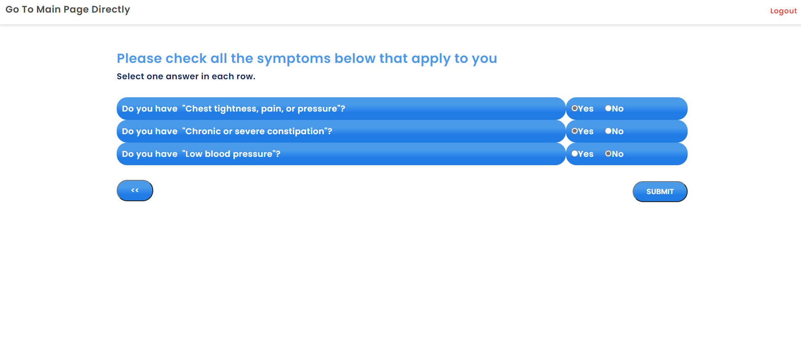
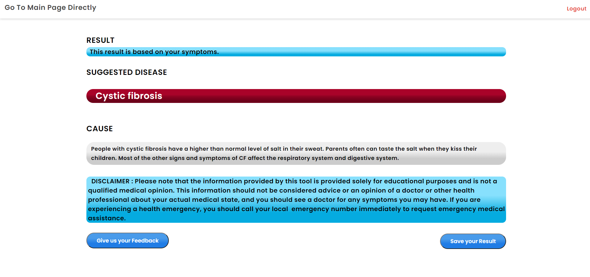
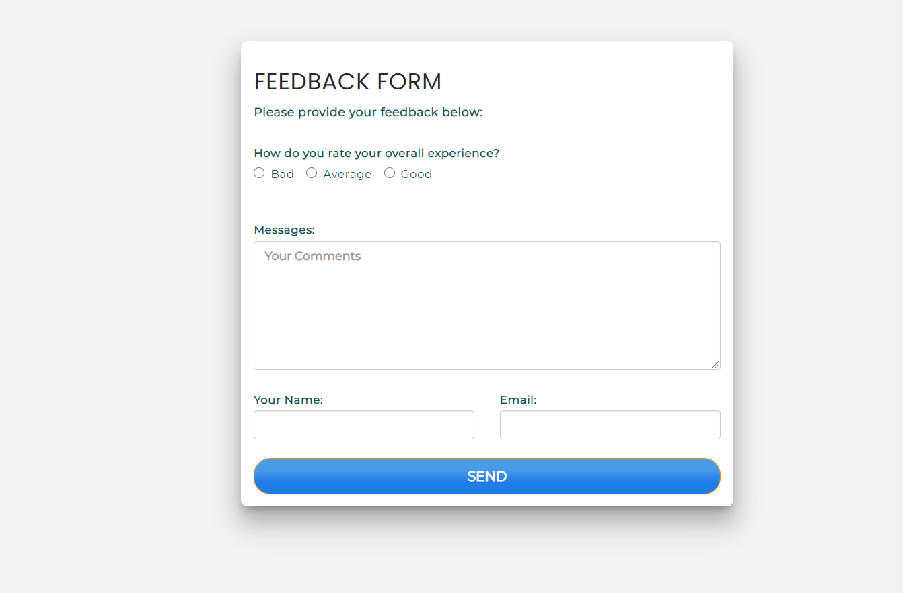

<h1>🩺 PredictaCare</h1>

This Project is predict the disease based on your Symptoms .Here ,the I use Html, CSS, JavaScript ,PHP ,MySql ,JQuery. .Before Enter to the project at first insert the database into the sql database .Database file is given inside the project.

## Here, I am trying to do this project using core php .
<hr>

#### Project Description: This Project is basically predict the disease based on your symptoms. After Entering the system you can Login or Registration.Login is not mandatory for checking the disease. First you have to select the portion of your body which you feel bad.Then After selecting some symtopmps you can get the result.

#### Restriction : You can only check the front part of your body.And I am not working with the female part.


#### Cautions : You Cannot surely 100% sure that this is the right disease.It's just analyze the symptoms and based on that symptoms that produce output.

#### Credits : Some Symptoms and Disease Information are collected by Shoibe Akter and Nayeem-ul-Haque and the part of the skeleton are collected by Shoibe Akter🙂.

<hr>
✨ Key Features

- 👤 **User Authentication**: Secure signup and login for personalized health tracking.
- 🧬 **Body-Part Specific Analysis**: Interactive selection from various body parts (Head, Chest, Abdomen, Pelvis, etc.).
- 🔍 **Symptom Mapping**: Detailed symptom checklists for precise diagnostic logic.
- 📊 **Prediction Engine**: Real-time analysis of symptoms to determine the most likely disease.
- 🕒 **History Tracking**: Log of previous results for users to monitor their health over time.
- 🛠️ **Admin Dashboard**: Comprehensive control panel to manage diseases, symptoms, users, and feedback.
- 📝 **Feedback System**: Integrated communication channel for users to provide suggestions or report issues.


  🚀 Tech Stack

- **Frontend**: HTML5, CSS3, JavaScript, jQuery
- **Backend**: PHP (Core PHP & PDO)
- **Database**: MySQL
- **Design Elements**: Custom CSS layouts and interactive UI components.s

🛠️ Setup & Installation

Follow these steps to get the project running locally:

### 1. Prerequisites
Ensure you have a local server environment installed (e.g., **XAMPP**, **WAMP**, or **MAMP**).

### 2. Clone the Repository
```bash
git clone https://github.com/prakash200514/PredictaCare.git
```

### 3. Database Configuration
1. Start **Apache** and **MySQL** from your XAMPP Control Panel.
2. Open **phpMyAdmin** (`http://localhost/phpmyadmin`).
3. Create a new database named `disease`.
4. Import the `disease.sql` file located in the `database/` folder of this project.

### 4. Connection Setup
If your MySQL root password is not blank, update the connection settings in:
- `link/config.php`
- Any individual files using `mysqli_connect` (e.g., `delete_users.php`, etc.)

### 5. Launch the Application
Move the project folder to `C:\xampp\htdocs\`.
Access the application via: `http://localhost/disease/`

---
⚠️ Important Cautions

> [!WARNING]  
> **Medical Disclaimer**: This application is for educational and informational purposes only. It is **not** a substitute for professional medical advice, diagnosis, or treatment. Always seek the advice of your physician or other qualified health providers with any questions you may have regarding a medical condition.

- **Scope**: Currently focuses on the front part of the body and general symptoms.
- **Accuracy**: Predictions are based on the symptoms provided and may not be 100% accurate.


 Some Samples of this project is given below :












